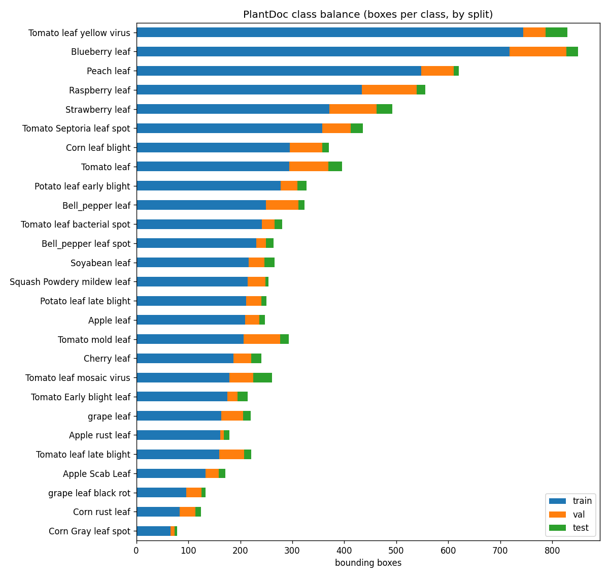
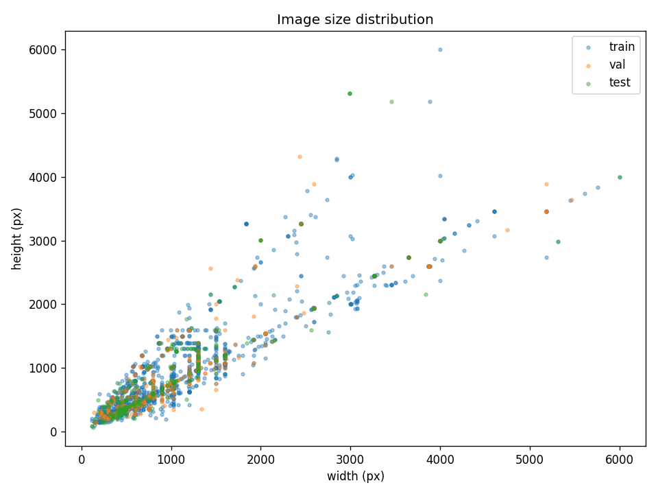
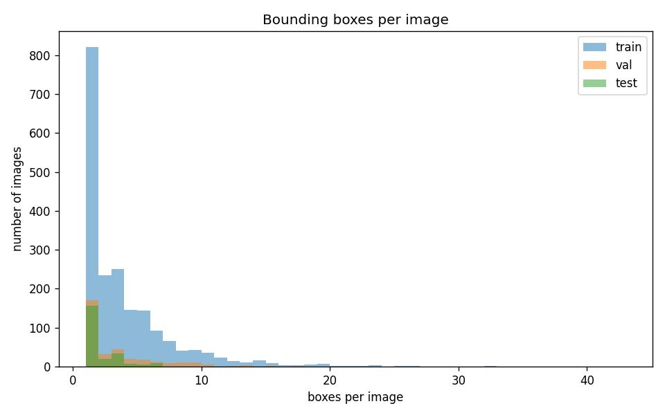
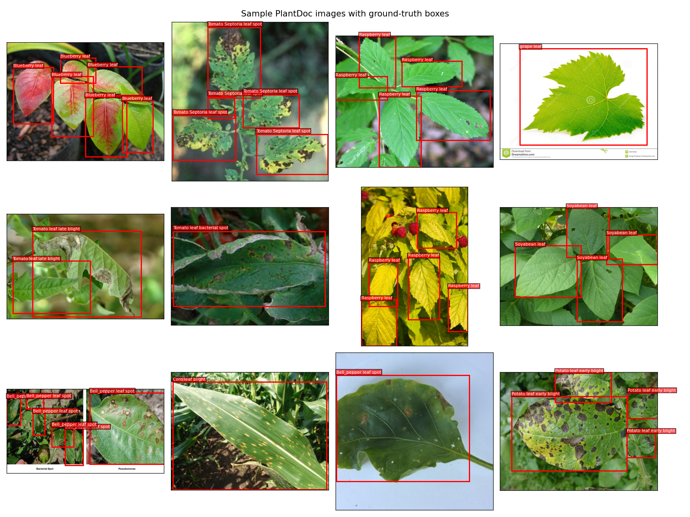

# PlantDoc Detection — EDA Report

**Dataset:** PlantDoc-Object-Detection  
**Source:** https://github.com/pratikkayal/PlantDoc-Object-Detection-Dataset  
**License:** CC-BY-4.0

> PlantDoc is a genuine **object-detection** dataset (real bounding boxes on in-the-wild images), unlike PlantVillage which is classification-only. This is why the project can honestly claim detection + localization.

## Split sizes

| Split | Images | Boxes | Avg boxes/img |
|-------|-------:|------:|--------------:|
| train | 1990 | 7219 | 3.63 |
| val | 352 | 1222 | 3.47 |
| test | 236 | 452 | 1.92 |

## Data quality (conversion drops)

Counts of annotations dropped or adjusted while converting PlantDoc's CSV boxes to YOLO labels. Kept boxes exclude the dropped ones; clamped boxes are kept but had coordinates pulled back into `[0, 1]`.

| Split | Kept boxes | Dropped (degenerate) | Dropped (bad dims) | Dropped (excluded class) | Clamped | Rows w/ missing image |
|-------|-----------:|---------------------:|-------------------:|-------------------------:|--------:|----------------------:|
| train | 7219 | 0 | 4 | 11 | 0 | 11 |
| val | 1222 | 0 | 0 | 2 | 0 | 0 |
| test | 452 | 0 | 0 | 0 | 0 | 0 |
| **total** | **8893** | **0** | **4** | **13** | **0** | **11** |

- **Degenerate boxes dropped:** 0 — zero/negative-area boxes (`xmax <= xmin` or `ymax <= ymin`) that carry no usable localization signal.
- **Bad-dimension boxes dropped:** 4 — CSV rows recording image `width` or `height` as 0 (annotation errors); normalized coords are undefined.
- **Excluded-class boxes dropped:** 13 — boxes belonging to classes removed via `excluded_classes` in the config (see below); dropped for evaluation integrity, not data quality.
- **Boxes clamped:** 0 — boxes spilling past the image edge, kept with coordinates clamped to `[0, 1]`.
- **Rows referencing missing images:** 11 — CSV rows whose image file was absent from the download; the whole image (and its boxes) is skipped.

## Classes (27)

Excluded from this dataset for evaluation integrity: `Tomato two spotted spider mites leaf`, `Potato leaf`. Each had too little training signal *and* zero TEST-split representation, leaving no honest way to measure detection performance on them.

Per-class box counts (train / val / test):

| ID | Class | Train | Val | Test |
|---:|-------|------:|----:|-----:|
| 0 | Apple Scab Leaf | 133 | 25 | 13 |
| 1 | Apple leaf | 209 | 28 | 10 |
| 2 | Apple rust leaf | 161 | 7 | 11 |
| 3 | Bell_pepper leaf | 249 | 63 | 11 |
| 4 | Bell_pepper leaf spot | 231 | 18 | 15 |
| 5 | Blueberry leaf | 718 | 109 | 22 |
| 6 | Cherry leaf | 187 | 34 | 19 |
| 7 | Corn Gray leaf spot | 66 | 8 | 4 |
| 8 | Corn leaf blight | 295 | 63 | 12 |
| 9 | Corn rust leaf | 83 | 31 | 10 |
| 10 | Peach leaf | 548 | 62 | 10 |
| 11 | Potato leaf early blight | 278 | 32 | 17 |
| 12 | Potato leaf late blight | 211 | 29 | 10 |
| 13 | Raspberry leaf | 434 | 105 | 17 |
| 14 | Soyabean leaf | 216 | 30 | 20 |
| 15 | Squash Powdery mildew leaf | 214 | 34 | 6 |
| 16 | Strawberry leaf | 371 | 91 | 30 |
| 17 | Tomato Early blight leaf | 175 | 20 | 19 |
| 18 | Tomato Septoria leaf spot | 358 | 54 | 24 |
| 19 | Tomato leaf | 294 | 75 | 27 |
| 20 | Tomato leaf bacterial spot | 241 | 25 | 14 |
| 21 | Tomato leaf late blight | 159 | 48 | 14 |
| 22 | Tomato leaf mosaic virus | 179 | 46 | 36 |
| 23 | Tomato leaf yellow virus | 744 | 43 | 42 |
| 24 | Tomato mold leaf | 206 | 71 | 16 |
| 25 | grape leaf | 163 | 42 | 15 |
| 26 | grape leaf black rot | 96 | 29 | 8 |

## Image sizes

- Width:  min 115, median 800, max 6000
- Height: min 69, median 667, max 6000
- Unreadable/corrupt images: 0

## Plots

### Class balance

### Image size distribution

### Boxes per image

### Sample images with boxes

## Honest notes

- PlantDoc is small (~2.6k images) and scraped from the web, so images are noisy and class balance is skewed. Expect modest mAP — this is reported honestly rather than cherry-picked.
- Some CSV rows reference missing images or contain degenerate (zero-area) boxes; these are skipped during conversion (see `agridrone.data`).
